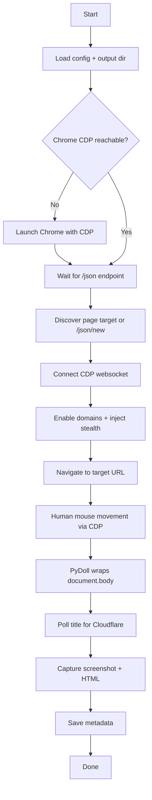

# PyDoll + CDP Hybrid Automation (Phase 1)

This project implements a hybrid browser automation pipeline that combines **raw Chrome DevTools Protocol (CDP)** control with **PyDoll element operations**. The goal is to keep a real Chrome fingerprint (fonts, GPU, cookies, session history) while still allowing automation that is less detectable than headless Chromium.

The system attaches to an existing Chrome instance running with CDP enabled and then:
- Uses **CDP** for low‑level control (enable domains, navigation, evaluation, mouse events, screenshots, HTML)
- Uses **PyDoll** for element-level interactions (so you are not CDP-only)

## Why Hybrid (CDP + PyDoll)

- **CDP** gives full control over the browser at a low level and is ideal for stealth and precise event simulation.
- **PyDoll** provides a higher-level, element‑oriented API that is easier to reason about and maintain.
- Combined, you get **stealth + stability** without relying purely on one layer.

## Architecture Overview

```
pydoll-phase1/
├── Dockerfile
├── docker-compose.yml
├── requirements.txt
├── app/
│   ├── main.py                 # Entry point
│   ├── browser/
│   │   ├── cdp_utils.py         # CDP client + helpers
│   │   └── launcher.py          # Chrome startup + target discovery
│   ├── utils/
│   │   ├── artifacts.py         # Screenshot + HTML + metadata
│   │   └── ip_utils.py          # Public IP helper
│   └── config/
│       └── settings.py          # Centralized config
└── data/
    └── output/                  # Artifacts
```

## Flow Diagram



## Execution Flow

1. **Initialize**
   - Determine output directory
   - Fetch public IP (optional metadata)

2. **Ensure Chrome with CDP**
   - If Chrome isn’t running with CDP, launch it (local only)
   - Wait until `http://localhost:9222/json` is reachable

3. **Discover CDP Target**
   - Query `/json` for a page target
   - If none exist, open a new target (`/json/new`)

4. **Hybrid Control**
   - CDP: enable domains, inject stealth, navigate, mouse movement
   - PyDoll: wrap a CDP objectId in `WebElement` for element ops

5. **Cloudflare Handling**
   - Poll `document.title` until the challenge clears

6. **Artifacts**
   - Save screenshot + HTML
   - Write metadata (timestamp, IP, URL, CDP endpoint)

## Running Locally

### 1) Start Chrome with CDP

Important: Chrome must be started with debugging flags **from a fully closed state**.

macOS:
```bash
"/Applications/Google Chrome.app/Contents/MacOS/Google Chrome" \
  --remote-debugging-port=9222 \
  --remote-debugging-address=127.0.0.1 \
  --user-data-dir=/tmp/chrome-cdp
```

Linux:
```bash
google-chrome \
  --remote-debugging-port=9222 \
  --remote-debugging-address=127.0.0.1 \
  --user-data-dir=/tmp/chrome-cdp
```

Windows (PowerShell):
```powershell
& "C:\Program Files\Google\Chrome\Application\chrome.exe" `
  --remote-debugging-port=9222 `
  --remote-debugging-address=127.0.0.1 `
  --user-data-dir="C:\temp\chrome-cdp"
```

Verify:
```bash
curl http://127.0.0.1:9222/json
```
You should see JSON output.

### 2) Install dependencies

```bash
python3 -m venv .venv
source .venv/bin/activate
python3 -m pip install -r requirements.txt
```

### 3) Run

```bash
python3 -m app.main
```

Artifacts will be written to `data/output/`.

## Target URL

Default target is set in `app/config/settings.py`:
```
https://www.scrapingcourse.com/antibot-challenge
```

Override at runtime:
```bash
TARGET_URL="https://example.com" python3 -m app.main
```

## Docker (Optional)

Docker does **not** run Chrome inside the container. You must run Chrome on the **host** with CDP enabled, then the container connects to it.

Start Chrome on macOS with CDP enabled (required before running the container):

```bash
"/Applications/Google Chrome.app/Contents/MacOS/Google Chrome" \
  --remote-debugging-port=9222 \
  --remote-debugging-address=127.0.0.1 \
  --user-data-dir=/tmp/chrome-cdp
```

```bash
docker-compose up --build
```

Implementation details (Docker flow):
- The Docker image only contains Python + dependencies. It does not bundle Chrome.
- The container connects to the host’s Chrome via CDP:
  - macOS: `docker.for.mac.localhost:9222`
  - Windows/Linux: `host.docker.internal:9222`
- Artifacts are written to `/app/output` and mounted back to `data/output/` on the host.

## Configuration

Environment variables:
- `RUNNING_IN_DOCKER` (default: `false`)
- `CDP_HOST` (default: `localhost` or `docker.for.mac.localhost` in Docker)
- `CDP_PORT` (default: `9222`)
- `OUTPUT_DIR` (default: `data/output` or `/app/output` in Docker)
- `TARGET_URL` (default: scrapingcourse anti‑bot page)
- `CHROME_LAUNCH_TIMEOUT_SEC` (default: `20`)
- `CF_POLL_INTERVAL_SEC` (default: `1`)

## Troubleshooting

### CDP not reachable
If you see:
```
RuntimeError: Chrome did not start with CDP enabled in time.
```
Then Chrome was not started with CDP correctly. Fully quit Chrome and restart with the CDP flags.

### No CDP targets found
This usually means:
- CDP isn’t actually running, or
- Chrome started but no page targets exist yet.

The app now auto‑creates a new target via `/json/new` when this happens.

### No screenshot or HTML
If artifacts are missing:
- Ensure `data/output/` exists and is writable
- Check the run logs for any CDP errors

## Notes

- This is **not** a headless workflow. It assumes a real Chrome instance for more realistic fingerprints.
- PyDoll usage is intentionally minimal and safe: the pipeline still succeeds even if PyDoll element checks fail.
